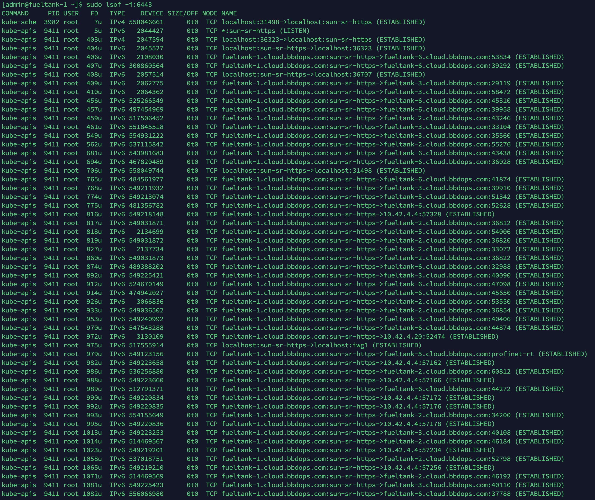

# Kubernetes 核心组件运行原理

Kubernetes 的核心组件包括：kubelet、kube-proxy、kube-apiserver、kube-scheduler、kube-controller-manager。

另外还包括 Etcd，另开了一个专题积累 Etcd 技术，这里不做记录了。

参考：《Kubernetes 权威指南（第四版）》第五章

## kube-apiserver

总体来看，kube-apiserver 的核心功能是提供各类资源对象（Pod，Service等）的增删改查及Watch等HTTP Rest接口，成为集群内各个功能模块之间数据交互和通信的中心枢纽，是整个系统的数据总线。除此之外，还有以下功能：

1. 集群管理的 API 入口
2. 资源配额控制的入口
3. 提供了完备的集群安全机制

### 概述

kube-apiserver 运行在 master 之上。默认情况下，它监听本机的 6443 端口（https）。

检查 6443 端口会看到许多连接：




可以看到 kube-apiserver 和其他组件都有交互。

kubectl 就是与 kube-apiserver 进行交互的，他们之间的接口是 RESTFul API。当然也可以使用 curl 命令进行交互。

```bash
$ curl -k https://localhost:6443/api
{
  "kind": "Status",
  "apiVersion": "v1",
  "metadata": {
    
  },
  "status": "Failure",
  "message": "Unauthorized",
  "reason": "Unauthorized",
  "code": 401
}
```

当然，会爆401错误，关于证书和认证我们后面再学习。

也可以使用`kubectl proxy` 来越过这些机制：

```bash
[admin@fueltank-1 software]$ kubectl proxy &
[1] 23205
[admin@fueltank-1 software]$ Starting to serve on 127.0.0.1:8001
[admin@fueltank-1 software]$ curl http://localhost:8001/api
{
  "kind": "APIVersions",
  "versions": [
    "v1"
  ],
  "serverAddressByClientCIDRs": [
    {
      "clientCIDR": "0.0.0.0/0",
      "serverAddress": "172.20.20.233:6443"
    }
  ]
}
```

注意这里的 `kubectl proxy` 仅仅是 kubectl 的一个子命令，和 kube-proxy 没任何关系。

kubectl proxy 也可以设置拒绝访问某些资源：

```
[admin@fueltank-1 software]$ kubectl proxy --reject-paths="^/api/v1/pods" &
[1] 1628
[admin@fueltank-1 software]$ Starting to serve on 127.0.0.1:8001
[admin@fueltank-1 software]$ curl http://localhost:8001/api/v1/pods
Forbidden
```

kubectl proxy 还有很多特性，之后在学。

除了 kubectl 和 curl 之外，最后一种方式就是通过编程方式调用 kube-apiserver。

编程方式调用又分两种。

**第一种**，运行在 Pod中的进程调用 kube-apiserver 。通常用来在k8s中搭建分布式软件集群（如 Elasticsearch集群）的目标。这种情况下，Pod 中的进程如何知道 kube-apiserver的访问地址那？答案很简单，也很巧妙，kube-apiserver 本身也映射成了一个 Service，它的名称就是 kubernetes，并且它的 Cluster IP地址是 Cluster IP 地址池里的第一个地址，它的服务端口是 443:

```bash
[admin@fueltank-1 software]$ kubectl get svc
NAME         TYPE        CLUSTER-IP      EXTERNAL-IP   PORT(S)    AGE
kubernetes   ClusterIP   10.43.0.1       <none>        443/TCP    18d
```

**第二种**，开发 k8s 的管理平台。

---

由于 kube-apiserver 是 Kubernetes 集群数据的唯一访问入口，因此安全性和高性能是 kube-apiserver 设计的核心目标。

通过采用HTTPS安全通道和CA证书签名证书强制双向认证来保证安全性。另外，为了更细粒度地控制用户或应用对 Kubernetes 资源对象的访问权限，Kubernetes 启用来了 **RBAC** 访问控制策略。

通过以下方式来保证 kube-apiserver 的高性能。

1. 使用大量高性能的底层代码，采用 协程 + 队列 的方式处理并发。
2. 普通List接口结合异步 Watch 接口
3. 采用高性能的 etcd 数据库。

---

### kube-apiserver 架构解析

主要包括以下几层：

1. API 层，这一层主要提供 API，主要包括各种资源的增删改查和Watch等主要API。也包括健康检查，日志，性能指标等运维监控API。
2. 访问控制层，对访问进行鉴权。根据 （Admission Control）判断是否允许访问。
3. 注册表层，Kubeernetes 把各种资源对象都保存在了注册表中，包括资源对象的类型，如果创建资源对象，如何转换不同资源对象的不同版本，如何将资源编码解码为 JSON 或 ProtoBuf 格式进行储存。
4. etcd 数据库层，用于持久化储存 Kubernetes 资源对象的 KV 数据。etcd 的 watch 接口对 kube-apiserver 来说非常重要，因为通过这个接口，kube-apiserver 创新性的设计了 List-Watch 这种高性能的资源对象实时同步机制。

---

下面解读一下 List-Watch 机制。

就是各个组件之间可以互相 watch。

---

CRD 在 kube-apiserver 中的设计和实现机制：

1. 资源对象元数据（schema）的定义，官方内建对象是固化在源码中的。
2. 资源对象校验逻辑，确保用户提交的资源对象属性的合法性。
3. 资源对象的 CURD 操作代码。
4. 资源对象背后相关的“自动控制器”。

类似的，自定义 CRD 的开发者都需要实现上边的功能，前三个功能通过写 YAML 文件即可实现，第四个需要写代码。不过 API Server 提供了大量的基础 API 库，特别是易用的 List-Watch 编程框架，也使得 CRD 自动控制器的编程难度大大减小。

---

### 独特的 Kubernetes Proxy API 接口

除了上边的 API，kube-apiserver 还提供了一类很特殊的 REST 接口 --- Kubernetes Proxy API 接口，这类接口的作用就是代理 REST 请求，即 Kubernetes API Server 把收到的 REST 请求转发到某个 Node 的 kubelete 守护进程的 REST 端口，由该 kubelet 进程负责响应。

首先说关于 Node 的相关接口，包含一以下三个具体接口：

```
/api/v1/proxy/nodes/{name}/pods/
/api/v1/proxy/nodes/{name}/stats/
/api/v1/proxy/nodes/{name}/spec/
```


看名字能看出来什么作用，不赘述了。

也可以通过 Kubernetes Proxy API 来访问 Pod 的接口

```
/api/v1/proxy/nameespaces/{namespace}/pods/{name}/{path:*}
/api/v1/proxy/nameespaces/{namespace}/pods/{name}
/api/v1/nameespaces/{namespace}/pods/{name}/proxy/{path:*}
/api/v1/nameespaces/{namespace}/pods/{name}/proxy/
```

上边俩和下面俩的功能是一样的，只是写法不同。

另外也有 Service 的：

```
/api/v1/proxy/nameespaces/{namespace}/services/{name}
```

---

### 集群功能模块之间的通信

kube-apiserver 是集群的核心，负责集群各个功能模块之间的通信。集群内的各个模块通过 API Server 将信息存入 etcd，当需要获取和操作这些数据时，则通过 API Server 提供的 REST 接口来实现，从而实现各模块之间的信息交互。

---

##

## kube-controller-manager 原理解析

控制器用来修正系统的运行状态。他们通过 Api Server 模块提供的 watch 接口来实时监控特定资源的状态变化，当发生各种故障导致某资源对象发生变化时，Controller 会尝试将其状态调整为期待的状态。

Controller Manager 包括Replication Cantroller，Node Controller，ResoourceQuota Controller（资源配额控制器），Namespace Controller，ServiceAccount Controller，Token Controller，Service Controller 及 Endpoint Controller 这8种 Controller。

---

kube-proxy 组件会使用 Endpoints 对象。

---


## kube-scheduler 原理解析

kubr-scheduler 在系统中承担了“承上启下”的重要功能，承上是指接受 kube-controller-manager 的指令，为 Pod 找到一个 Node，启下是指安置工作完成后，目标 Node 上的 kubelet 进程将接管后续工作，负责 Pod 生命周期的”下半生“。

Kubelet 通过 Api Server 监听到 Pod 绑定事件后，然后获取对应的 Pod 清单，下载 Image 镜像并启动容器。

---


## kubelet 运行机制解析

